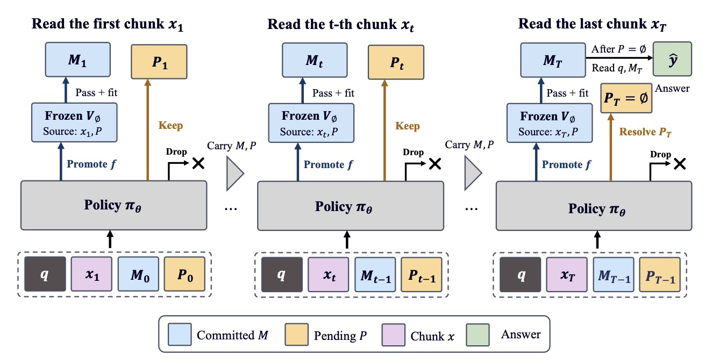
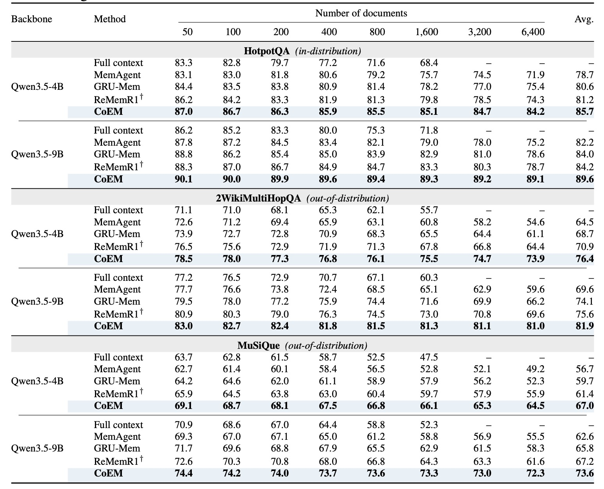
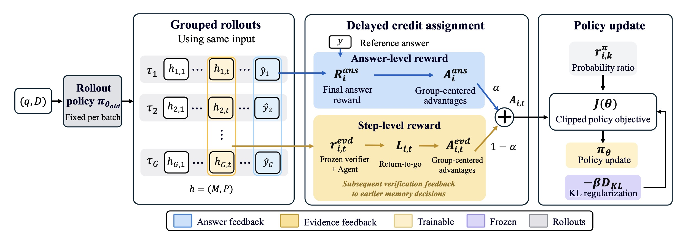

<div align="center">

<h1>CoEM: Empowering Long-Context Reasoning with Commit-on-Evidence Memory</h1>

<p><strong>Anonymous code submission · ICLR 2027</strong></p>
<p>Backbones: Qwen3.5-4B / Qwen3.5-9B · Verifier: DeBERTa-v3-small NLI</p>

</div>

---

## 📰 News

- **2026-09-29:** Our paper has been submitted to ICLR 2027. Upon acceptance, the full source code will be released on GitHub, and the model weights will be released on Hugging Face. Links and release instructions will be added here when available.

## 📖 Introduction

Long-context reasoning degrades as inputs grow. Recurrent memory agents read a document stream chunk by chunk and keep a bounded textual memory in the model context, but *premature compression* discards details whose relevance only becomes clear later. **CoEM (Commit-on-Evidence Memory)** learns **when** to convert source evidence into compact memory facts:

- **Pending set for unresolved evidence.** Under a fixed context-memory budget `B = B_M + B_P`, CoEM keeps potentially useful source excerpts *verbatim* in a pending set `P` (`B_P` tokens) next to the committed memory `M` (`B_M` tokens). As new chunks arrive, a learned policy revisits each pending excerpt and decides to **Promote**, **Keep**, or **Drop** it.
- **Source-verified atomic commitment.** A frozen NLI verifier (`cross-encoder/nli-deberta-v3-small`, threshold `η = 0.90`) accepts a proposed fact only if the cited source excerpts still available in the current chunk or the pending set entail it. Replacements `(E⁻, E⁺)` of committed memory are applied as one transaction, or not at all.
- **Step-level evidence rewards.** The policy is trained with reinforcement learning that combines the final-answer reward with per-chunk evidence penalties for verifier rejections and invalid operations, propagated through a return-to-go so that later verification feedback reaches earlier admission and Keep decisions.

<div align="center">
  
  <br><em>CoEM inference. The policy promotes, keeps, or drops source evidence as it reads each chunk. A frozen verifier gates commitment to memory; pending evidence is resolved before the final answer.</em>
</div>

### Highlights
- **🧠 Delayed commitment under a fixed budget.** Same 1,024-token persistent state as MemAgent / GRU-Mem / ReMemR1; `B_P = 256` pending tokens, `B_M = 768` committed tokens.
- **✅ Verified facts only.** Every committed fact carries its source span identifiers `ρ = (t, l, r)`; provenance is auditable and nothing enters memory without a passing entailment check.
- **📈 Widening margin with length.** Evaluated on 6,400 documents (~0.8M tokens), CoEM outperforms the strongest memory baseline by 10.4–11.4 F1 with Qwen3.5-9B while its own F1 declines by only 1.0–2.1 points from 50 to 6,400 documents.

<div align="center">
  
  <br><em>Main results reported in the paper. Answer F1 (%) across eight context lengths on HotpotQA, 2WikiMultiHopQA, and MuSiQue. Bold values identify the best result for each backbone and document count.</em>
</div>

### Multi-conversation RL with step-level evidence rewards
For each training sample the rollout policy samples `G = 8` complete trajectories. Each trajectory receives the answer reward `R^ans ∈ [0,1]` (normalized token F1) and, per reading step `t`, the evidence reward

```
r_evd[t] = -λ_v · m_rej[t] - λ_f · m_inv[t],        L[t] = (1/T) Σ_{u ≥ t} r_evd[u]
A[i,t]   = α · (R^ans_i - mean_j R^ans_j) + (1 - α) · (L[i,t] - mean_j L[j,t])
```

with `α = 0.8`, `λ_v = 0.20`, `λ_f = 0.05`, no standard-deviation normalization. All policy calls issued while reading chunk `t` share `A[i,t]`; the answer call uses `α · A^ans`. Advantages enter a clipped policy objective (`ε = 0.2`) with a reference-KL term (`β = 1e-3`). Only policy-generated tokens receive gradients; source text, controller execution, and verifier outputs do not.

<div align="center">
  
  <br><em>CoEM training. Grouped rollouts combine final-answer rewards with step-level evidence feedback. Return-to-go assigns later verification feedback to earlier memory decisions, followed by a clipped policy update with KL regularization.</em>
</div>

## 🗂️ Repository layout

```
CoEM/
  coem/                      # framework-independent core
    config.py                #   CoEMConfig: budgets B/B_P/B_M, H/K/J, verifier, reward weights
    state.py                 #   h = (M, P): entries, pending records, serialization, token accounting ℓ(·)
    actions.py               #   action schema (<actions>{JSON}</actions>) and structural parser
    episode.py               #   the CoEM agent: Extract / ApplyActions / Resolve / Flush, atomic transactions
    verifier.py              #   frozen DeBERTa-v3 NLI gate (window W_V = 512, threshold η, temperature T_cal)
    rewards.py               #   answer F1/EM, evidence rewards, return-to-go, group-centered advantages
    prompts.py               #   bounded-observation prompts (main / capacity / forced / answer)
  recurrent/                 # multi-conversation RL framework (from MemAgent / ReMemR1)
    impls/coem_agent.py      #   sync batched RAgent + CoEMDataset (verl rollout loop)
    impls/coem_async.py      #   async agent for verl's OpenAI-compatible async rollout
  verl/                      # verl trainer fork (PPO/GRPO, FSDP, vLLM rollout); CoEM advantage branch in
                             #   trainer/ppo/ray_trainer.py, reward in utils/reward_score/coem_qa.py
  taskutils/
    coem_data/               #   nested evaluation streams + training parquet construction
    coem_eval/               #   OpenAI-compatible evaluation harness (CoEM + MemAgent control), aggregation
    coem_verifier/           #   verifier temperature / threshold calibration and blinded audit
  scripts/                   # setup_env.sh, prepare_data.sh, serve.sh, train_coem_{4B,9B}.sh,
                             #   train_ablations.sh, eval_coem.sh, merge_ckpt.sh
  tests/                     # CPU unit tests (controller invariants, parser, rewards, data helpers)
  docs/figures/              # framework, training, and main-results figures
  logs/                      # documentation of generated logs and result formats
  THIRD_PARTY/               # upstream attribution and notices
```

## 🚀 Installation

The code is developed and tested in a conda environment named **`CoEM`** (Python 3.12). The recipe mirrors MemAgent's installation with the serving engine raised to a version that ships native Qwen3.5 support.

```bash
conda create -n CoEM python=3.12 -y
conda activate CoEM
pip install "vllm==0.30.0"          # pins torch / transformers consistently
pip install -r requirements.txt
pip install flash-attn --no-build-isolation   # optional, FSDP training speed-up
```

or simply `bash scripts/setup_env.sh`. Verified stack: `torch 2.13 (cu130)`, `vllm 0.30.0`, `transformers 5.17`, `ray 2.58`, `tensordict 0.14`.

Checkpoints used in the paper:

```bash
export MODELROOT="${MODELROOT:-$PWD/models}"
mkdir -p "$MODELROOT"
hf download Qwen/Qwen3.5-4B --local-dir $MODELROOT/Qwen3.5-4B
hf download Qwen/Qwen3.5-9B --local-dir $MODELROOT/Qwen3.5-9B
hf download cross-encoder/nli-deberta-v3-small --exclude "onnx/*" --local-dir $MODELROOT/nli-deberta-v3-small
```

Run the CPU unit tests:

```bash
python -m pytest tests/ -q
```

## ⚡ Quickstart

Run commands from the repository root. Before evaluation, prepare the datasets using the command in the **Data** section and download the required checkpoints as described above. Datasets, model weights, and generated experiment outputs are not bundled with this code submission.

1. Serve a policy (tensor parallel 1 for Qwen3.5-4B, 2 for Qwen3.5-9B; 9,216-token window, 0.80 memory utilization, 32,768 scheduler tokens):

   ```bash
   MODEL_PATH=$MODELROOT/Qwen3.5-4B SERVED_NAME=Qwen3.5-4B TP=1 PORT=8000 bash scripts/serve.sh
   ```

2. Run CoEM on one evaluation split:

   ```bash
   python taskutils/coem_eval/run_eval.py \
       --data data/eval/eval_hotpotqa_800.jsonl --model Qwen3.5-4B --tokenizer $MODELROOT/Qwen3.5-4B \
       --base_url http://127.0.0.1:8000/v1 --verifier_path $MODELROOT/nli-deberta-v3-small \
       --out_dir results/coem_qwen3.5-4b --method coem --concurrency 64 --log_prompts
   ```

   Per-question trajectories (calls, parsed operations, verifier scores, committed memory, occupancy) are written to `results/.../eval_hotpotqa_800.coem.jsonl`, the summary (F1 ×100 with a 10,000-resample bootstrap CI, EM, latency, tokens, controller statistics) to `...summary.json`.

3. Drive the controller yourself:

   ```python
   from transformers import AutoTokenizer
   from coem import CoEMConfig, CoEMEpisode, NLIVerifier
   from coem.episode import run_episode, split_chunks

   tok = AutoTokenizer.from_pretrained("Qwen/Qwen3.5-4B")
   cfg = CoEMConfig().validate()                       # C=5000, B=1024, B_P=256, H=8, K=1, J=2, eta=0.90
   verifier = NLIVerifier("cross-encoder/nli-deberta-v3-small", threshold=cfg.verifier_threshold)
   chunks = split_chunks(tok.encode(document, add_special_tokens=False), cfg.chunk_size)
   episode = CoEMEpisode(cfg, question, chunks, tok, verifier)
   result = run_episode(episode, policy=lambda req: my_llm(req.messages, max_tokens=req.max_tokens))
   print(result.answer, result.committed, result.m_rej, result.evd_returns)
   ```

## 🧩 The controller in one page

Every policy call receives the bounded observation `(q, x_t, M, P)` plus short controller feedback for the current chunk. The chunk is rendered with position markers `<@n>` every 100 tokens so that the policy can address token offsets; the controller copies `x_t[l:r]` itself and never trusts quoted text. Instructions, markers, feedback and attempt descriptors live in the 1,912-token reserve of the 8,192-token input (`5,000` chunk + `1,024` state + `256` question).

| Subroutine | What it does |
|---|---|
| `Extract(u, x_t, H)` | Parses at most `H = 8` fresh source specifications `[l, r)`; invalid offsets count toward `H` and `m_inv`. |
| `ApplyActions(u, M, P, x_t; J)` | Executes pending-record actions and immediate promotions in policy order. A promotion builds `(E⁻, E⁺)`, resolves cited spans (current chunk or pending records covering the span), checks the `J = 2` attempt allowance per record and chunk, the verifier window, the committed-memory budget, and finally the entailment gate; success consumes the target record and renumbers ranks. |
| `Resolve(M, P, x_t, p; K, J)` | Admits a validated excerpt directly if budgets hold; otherwise one (`K = 1`) reconsideration call, then oldest-first forced promote-or-drop until the excerpt fits. |
| `Flush(M, P, x_T; J)` | Terminal pass: every remaining record is promoted or dropped with Keep disabled, so `P_T = ∅`; the answer is generated from `(q, M_T)`. |

Counters per chunk: `m_inv` (format, offset, availability, attempt-cap, window and budget violations) and `m_rej` (structurally valid claims with `v_e < η`). Accepted facts receive no per-write bonus.

The action schema:

```
<think>...</think>
<actions>
{"pending": [{"rank": 1, "action": "promote", "claims": [{"fact": "Peggy Seeger is American.", "sources": ["#1"]}]},
             {"rank": 2, "action": "keep"}],
 "fresh":   [{"span": [120, 168], "action": "keep"},
             {"span": [400, 452], "action": "promote", "claims": [{"fact": "...", "sources": ["7:400-452"]}]}],
 "remove":  ["m3"]}
</actions>
```

## 📚 Data

```bash
FLASHRAG_ROOT=data/FlashRAG_datasets TOKENIZERS="Qwen/Qwen3.5-4B,Qwen/Qwen3.5-9B" bash scripts/prepare_data.sh
```

- **Evaluation streams** (`taskutils/coem_data/build_eval_streams.py`): 128 development questions per dataset (seed 4) whose complete supporting text fits 4,096 tokens and whose question fits 256 tokens under both policy tokenizers. Distractors are title–paragraph pairs from the training split, de-duplicated and cut to the longest complete-sentence prefix of 96–128 tokens. A stable hash of the question id and the seed selects the first `N_doc − |S_q|` distractors; independent stable keys order all documents, so each shorter context is a subsequence of every longer one (`N_doc ∈ {50, …, 6400}`). Documents are serialized as `[DOC id] title: text` with a manifest of chunk boundaries and support positions. `--mode gap --gap {0,2,8,32,64,128}` builds the activation-gap probe; `--mode stress` the source-dense ordering.
- **Training data** (`build_train_data.py`): 32,768 HotpotQA training questions + 512 disjoint development questions, 200 documents each, seeds 17 / 29 / 43, written as verl parquet (`prompt`, `context`, `reward_model.ground_truth`).

## 🏋️ Training

```bash
export MODEL_PATH=$MODELROOT/Qwen3.5-4B DATASET_ROOT=data/train PROJ_ROOT=checkpoints SEED=17
bash scripts/train_coem_4B.sh          # eight H800 / A100 GPUs, one node
bash scripts/train_coem_9B.sh          # TP=2 rollout
```

`recurrent.enable=coem` selects the CoEM agent (`recurrent/impls/coem_agent.py`) and the trainer's CoEM advantage branch. Hyper-parameters (batch 128 questions × `G = 8`, 500 updates, one PPO epoch, minibatch 8, AdamW `1e-6`, warm-up 20, clip 0.2, KL `1e-3`, `α = 0.8`, `λ_v = 0.20`, `λ_f = 0.05`, temperature 1.0 / top-p 1.0) are set in the scripts and can be overridden on the command line (Hydra). Development F1 on the 512 questions is evaluated every 25 updates; `trainer.save_best_val=True` keeps the best checkpoint (ties resolved toward the earlier one). Merge FSDP shards before serving:

```bash
bash scripts/merge_ckpt.sh checkpoints/coem_qwen3.5-4b_seed17/global_step_300/actor
```

Ablations (`scripts/train_ablations.sh <variant> [4B|9B]`): `eager_noverifier`, `eager_verifier` (`B_P = 0`), `pending_noverifier` (entailment gate off, `λ_v = 0`), `outcome_only` (`α = 1`), `fixed_step` (promotion two chunks after admission), `budget_<B_P>` for the sweep `B_P ∈ {0,128,256,384,512,768}`. The no-RL variant is the initialized policy evaluated with the same interface.

## 📊 Evaluation

```bash
MODEL=Qwen3.5-4B TOKENIZER=$MODELROOT/Qwen3.5-4B URL=http://127.0.0.1:8000/v1 METHOD=coem \
OUT_DIR=results/coem_qwen3.5-4b bash scripts/eval_coem.sh
METHOD=memagent OUT_DIR=results/memagent_qwen3.5-4b bash scripts/eval_coem.sh        # budget-matched control
python taskutils/coem_eval/aggregate.py --results results/coem_qwen3.5-4b results/memagent_qwen3.5-4b \
       --paired results/coem_qwen3.5-4b results/memagent_qwen3.5-4b --out results/main_table.md
```

Decoding is greedy with repetition penalty 1.0 and reasoning mode disabled. The primary metric is normalized token F1 (×100; lowercase, punctuation and articles removed, `yes/no/noanswer` must match exactly, max over references); exact match is recorded separately. Eight-length averages weight every length equally. Latency is measured from before the first recurrent prompt to the completed answer and includes serialization, rejected proposals, verifier calls and terminal processing (`DISABLE_PREFIX_CACHE=1 MAX_NUM_SEQS=1 bash scripts/serve.sh` for the timing study).

### Verifier calibration and audit

```bash
python taskutils/coem_verifier/calibrate.py --fit pairs_fit.jsonl --select pairs_select.jsonl --eval pairs_eval.jsonl
python taskutils/coem_verifier/audit.py --pairs attempts_2000.jsonl --calibration results/verifier/calibration.json \
       --generative Qwen3.5-9B --base_url http://127.0.0.1:8000/v1
```

`calibrate.py` fits one temperature by L-BFGS on the NLL of the frozen logits, selects `η` from `{0.70,…,0.95}` under a 5% false-acceptance constraint, and reports ten-bin ECE, three-class NLL and binary Brier score. `audit.py` computes faithfulness / FAR / FRR of the raw and calibrated gates, the `roberta-large-mnli` auxiliary judge and optional generative verifiers, with per-pair latency at batch size one.

## 📝 Citation

```bibtex
@inproceedings{coem2027,
  title     = {CoEM: Empowering Long-Context Reasoning with Commit-on-Evidence Memory},
  author    = {Anonymous},
  booktitle = {Submitted to the International Conference on Learning Representations (ICLR)},
  year      = {2027}
}
```

## Third-party components

The multi-conversation RL framework and trainer build on [MemAgent](https://github.com/BytedTsinghua-SIA/MemAgent), [ReMemR1](https://github.com/syr-cn/ReMemR1), and [verl](https://github.com/volcengine/verl). Upstream attribution and notices are collected in [THIRD_PARTY/NOTICES.txt](THIRD_PARTY/NOTICES.txt). Names in those notices identify upstream contributors.
